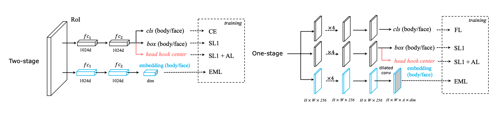
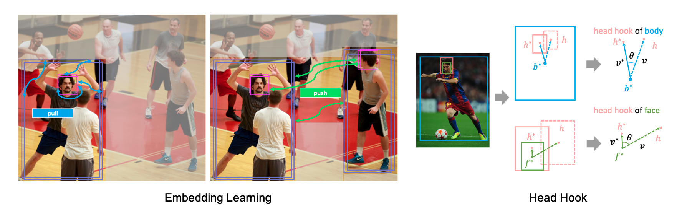
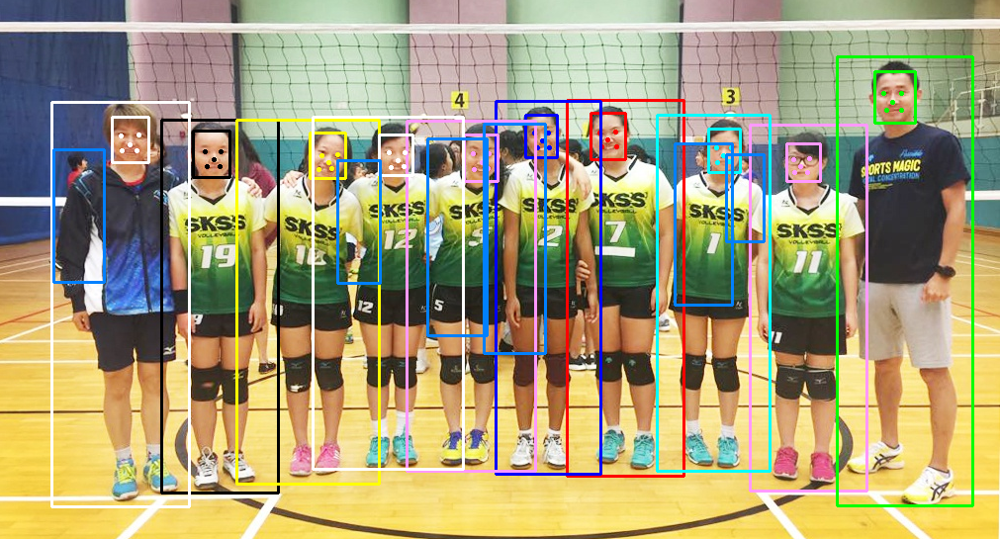

Semantic Body-Face-Landmark Joint Detection
===

This project (base on the re-implementation [BFJ](https://github.com/AibeeDetect/BFJDet.git) of the paper "[*Body-Face Joint Detection via Embedding and Head Hook*](https://openaccess.thecvf.com/content/ICCV2021/papers/Wan_Body-Face_Joint_Detection_via_Embedding_and_Head_Hook_ICCV_2021_paper.pdf)" published in ICCV2021). We use the facial landmarks as bridges instead of center heads in order to enrich the semantic connection between bodies and faces for surveilance in the wild. 

# Introduction

My motivation is to detect the group of body and face with landmarks of pedestrians in one shot detector, which is practical in many applications (such as tracking, MOT).
Inspired by BFJ, but this approach brings some significant ideas: 
1) From enhanced semantic level, using five facial landmarks as semantic bridges. 
2) From appearance level, learning representations via deep metric learning. 
3) Optimize the body-face matching process.

Apart from head hook of `BFJ` which is just a point embodying very vague semantic texture, facial landmarks are more interpretable for both computers and humans. 
Because they are visual charateristics in faces, constructed by motifs and details around eyes, nose and mouth 
and could be useful for facial analist, facial recognition, ...

<!-- 
 -->

<!--  -->

# Updates
- [x] Supplement the CrowdHuman annotations with landmarks.
- [x] Make landmarks prediction available and add some landmark losses (location, objectness and angular losses) in the training phase.
- [x] Synchronize the use of cosine distance for embedding matching in both training and testing which diverts this problem toward deep metric learning.
- [x] Convert maximum assignment at body-face matching to linear sum assignment at body-face matching.
- [x] Faster R-CNN + BFLJ on CrowdHuman with deep metric learning.
- [ ] RetinaNet + BFLJ on CrowdHuman.
- [ ] Yolov7 + BFLJ on CrownHuman.


# Data Preparing

I utilize the annotate body-face boxes of [CrowdHuman](https://arxiv.org/abs/1805.00123) from [BFJ](https://github.com/AibeeDetect/BFJDet.git) 
and generate landmarks for corresponding faces while constructing a new metrics assessing landmarks for body-face-landmark joint detection.
Please follow instructions below to get these data.

1. Download images from http://www.crowdhuman.org/.
2. Download body-face annotations from [GoogleDrive](https://drive.google.com/drive/folders/1Sk2IAmm_wTVh289RKs5FiU17siWrJJCu?usp=sharing), which contains the original body/head boxes and my newly annotated face boxes.
3. Generate RetinaFace based landmarks for faces in CrowdHuman using [RetinaFace pytorch](https://github.com/biubug6/Pytorch_Retinaface) and add them to annotations of CrowdHuman using my code [here](/home/tungpt/Workspace/vietth/Body_head_detection/A5000_BFJDet/lib/data/test_loader_gt.py). 
In particular, landmarks would accompany only one corresponding body-face pair, so that we convert the original CrowdHuman dataset into body-face-landmark data points.

# Quick & Easy Start

### 1. Environment settings

* python 3.9.16
* pytorch 1.12.0
* torchvision 0.13.1
* cuda 12.1
* scipy 1.9.1

### 2. Train/Test/Inference:

* Training: This version combines several loss functions: 
  + **loss_rcnn_loc**: L1 loss of boxes' locations.
  + **loss_rcnn_cls**: objectness loss.
  + **loss_rcnn_lmk**: L1 loss of faces' landmarks.
  + **loss_lmk_cls**: penalize the present/absent of landmarks.
  + **loss_rcnn_emb**: push/pull embedding loss.
  + **angular_loss_pos**: angular loss with head hooks.
  + **angular_loss_lmk**: angular loss with landmark hooks.
```shell
cd tools
python3 train.py -md rcnn_fpn_baseline -c 'bfj'
```
    
* Testing: Test the whole CrowdHuman dataset with some metrics. In this version, we added a metric called AL (average Landmark loss) for evaluating landmark at [database.py](./lib/evaluate_lmk/APMRToolkits/database.py). This metric is designed for measuring the area under curve of recall and landmark score.

```shell
cd tools
python3 test_bflj.py -md rcnn_fpn_baseline -r 30 -d 0 -c 'bfj'
```

* Inference: Inference any images from Crownhuman only with an index of `n` or random if leave it blank. 
```shell
cd tools
python3 inference_bflj.py -md rcnn_fpn_baseline -r 30 -d 0 -c 'bfj' -n 10

#Or inference with your own images.
cd tools
python3 inference_one_img.py -md rcnn_fpn_baseline -r 30 -d 0 -c 'bfj' -p 'path-to-your-image'
```


# Results
All models are based on ResNet-50 FPN.
| | AP@0.5(body/face)&uarr; | MR(body/face)&darr; | mMR(w/wo LSA)&darr; | AL | Model
| --- | --- | --- | --- | --- | --- |
| FRCN-FPN-POS (Baseline)  | 87.9/71.1 | 43.7/52.6 | 66.4/_ |      |[GoogleDrive](https://drive.google.com/file/d/1GFnIXqc9aG0eXSQFI4Pe4XfO-8hAZmKV/view?usp=sharing)|
| FRCN-FPN-BFJ             | **88.8**/70.0 | 43.4/53.2 | 52.5/_ |      |[GoogleDrive](https://drive.google.com/file/d/1E8MQf3pfOyjbVvxZeBLdYBFUiJA6bdgr/view?usp=sharing)|
| FRCN-FPN-BFLJ-mf (mine)   | 88.6/71.3 | 43.3/52.2 | 49.7/48.49 | 70.9 | [GoogleDrive](https://drive.google.com/file/d/1BiPQCjImzTmBx2zHTegIt1bEFuLLwgbd/view?usp=drive_link) |
| FRCN-FPN-BFLJ-cse (mine)  | 88.6/**71.3** | **42.9/52.5** | **49.5/48.36** | 70.9 | [GoogleDrive](https://drive.google.com/drive/folders/1pq66UE7EZDh3_TtF9qXPueJAfFhLjacd?usp=sharing) |
*Note: best figures are in bold*

# Contact

If you have any questions, feel free to contact me at (viet.tranhong148@gmail.com).
